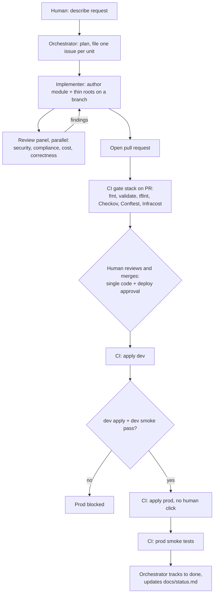
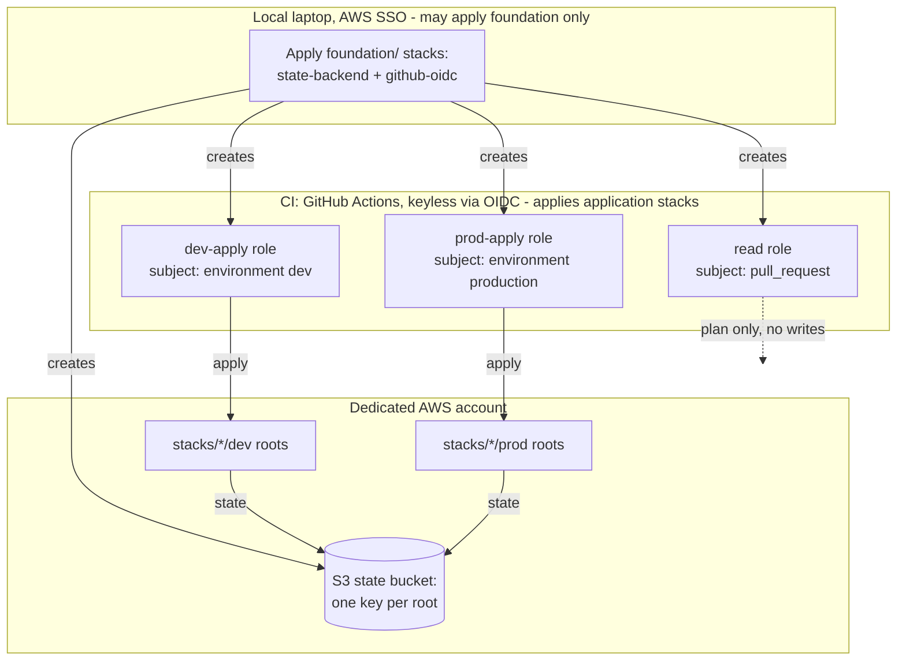

# DESIGN: Production-Grade Agentic AWS Infrastructure Workflow

*Audience: read when you need the "why" - the authoritative design and rationale behind the rules.*

This document is the authoritative specification for the workflow.
It is written to be consumed by an AI coding agent.
Read it fully before authoring, planning, or provisioning anything.
For the load-bearing terms it uses (root, stack, gate, the panel, the loop, and so on), see [`docs/glossary.md`](./docs/glossary.md).

This is version 2 of the design.
Version 1 established a laptop-driven, human-gated, local-apply workflow.
Version 2 matures it into a GitOps pipeline with automated quality, security, and compliance gates, a multi-agent review panel, and dev/prod environments.
Where v2 and v1 conflict, v2 wins.

## North star

The single guiding priority is production rigor: the workflow must be trustworthy, reviewable, auditable, and safe.
Multi-agent orchestration and every tool in the stack exist to serve that rigor, not for novelty.
Prefer quality, simplicity, robustness, and long-term maintainability over speed of iteration.

## Operating principles

These principles follow from the north star and from what it takes to make the hundredth agent run as trustworthy as the first (`learnings/agentic-consistency.md`, `learnings/context-budget.md`).
`AGENTS.md` states them as binding one-liners; this section is the reasoning behind them.
When a specific rule is silent, decide the way these point.

### Token discipline (context is a budget)

An agent's context window is finite, and every token spent reading is a token not spent reasoning.
So documentation and tooling are built for lean, on-demand loading: only the universal guardrails in `AGENTS.md` are always loaded, and depth (role procedure, the `provision-aws` skill, directory READMEs, this document) loads only when a task needs it.
Read narrowly, prefer targeted commands over broad discovery, and keep always-loaded files small.
A document has a cost, not only a value.

### Consistency and determinism (remove the choices)

Consistency across many independent runs is the hard part, and it does not come from better prose, because prose is interpreted and interpretation is exactly where two runs diverge.
It comes from removing choices: shared scripts that both local work and CI call, a scaffolder instead of layout instructions, a naming formula instead of a guideline, a Definition-of-Done checklist instead of a judgment call, discoverable state in a file instead of a memory.
Mechanize the decision so that any reasonable agent lands in the same place.

### Evidence-driven, no guessing

Every finding, claim, and change is grounded in evidence: a file and line, tool output, the plan diff, not recollection or assumption.
Reviewers must cite `file:line`; token usage is read from the provider or recorded as unavailable, never estimated; when an issue is genuinely ambiguous, an agent stops and asks rather than inventing an answer.
"Reasoned about" and "correct" are different properties, and this workflow demands both.

### No undocumented work or decisions

If it is not in the repo, it did not happen.
Every change moves through a pull request that carries its rationale; the state of the build lives in `docs/status.md`, not in one session's context; every failure learned the hard way becomes a `docs/troubleshooting.md` entry so it is handled the same way next time.
A cold agent, a human, or a different toolchain entirely must be able to reconstruct what is true and why by reading the repo.

### Single source of truth

Each fact has exactly one authoritative home, and everything else points to it: operational detail lives next to the code it governs (the directory READMEs), the "why" lives here, and the always-loaded rules live in `AGENTS.md`.
Duplication is not only maintenance debt; for an agent it is re-read cost and a place for two copies to drift.

### Gates are the floor, not the ceiling

Deterministic gates and reasoning reviewers fail in different ways and cover for each other (`learnings/multi-agent-review-panel.md`).
Problems are caught at the cheapest place to fix them (shift-left, before the PR), and CI remains the authoritative backstop.
A gate is never weakened to make a change pass; the change is fixed.

## Core execution model: GitOps

The privileged action, `terraform apply`, runs in CI, never on a laptop, for all application stacks.
An orchestrator agent (an Agile project manager) turns the request into issues; for each issue an implementer agent authors Terraform locally, reviews it with a local agent panel, and opens a pull request.
Human involvement is deliberately confined to two touchpoints per change: describing the request (planning), and reviewing and merging the PR. The merge is the single approval - it is both code approval and deploy approval, because the PR already carries the plan, cost, and review-panel findings the human needs to decide. After merge, CI applies dev then prod with no further human click; the gate between them is automated (dev apply and dev smoke must pass before prod runs).
The rule that defines the model: if a resource exists in AWS, it got there through a merged, gated, CI-run apply.

The only exception is foundational infrastructure (see "Local vs CI write boundary").

## Roles

Responsibilities are split across a few narrow agents so each one loads only what its task needs: the universal guardrails in `AGENTS.md` are always loaded, while role procedure and the `provision-aws` skill load on demand.
This keeps every agent's context lean and is why the work is decomposed into an orchestrator, an implementer, and a review panel rather than one generalist agent.

- Human: describes infrastructure in natural language, then reviews and merges PRs. Merge is the single deploy approval; there is no separate environment-gate click.
- Orchestrator agent: the Agile project manager (`.claude/agents/orchestrator.md`). It runs intake and planning, decomposes a request into GitHub issues for the implementer, launches the implementer with `scripts/implement.sh`, and manages the specialist agents and the loop to completion. It does not author, plan, or apply Terraform.
- Implementer agent: the builder (`.claude/agents/implementer.md`, driven by the `provision-aws` skill). It takes one issue and implements it - authoring the stack, running the review panel, and opening the PR - as a headless writable session. It does not apply application stacks.
- Review panel: four read-only reviewers (Security, Compliance, Cost, Correctness), defined in `.claude/agents/` and launched as independent, provider-agnostic agents via `scripts/review.sh` to critique the draft before the PR.
- CLIs: the agents run on interchangeable AI coding CLIs, selected per run by `scripts/agent.sh`, so load spreads across providers.
- CI: GitHub Actions. It runs the gates on PRs and performs applies via short-lived OIDC credentials.

## End-to-end loop

1. The human describes the desired infrastructure to the orchestrator.
2. The orchestrator clarifies scope, plans the work, and files one GitHub issue per independently-shippable unit. The issues are the handoff to the implementer.
3. For each issue the orchestrator launches a separate implementer session with `scripts/implement.sh <issue>`. The implementer creates or edits a stack as a module plus thin per-environment roots on a new branch, and runs `terraform fmt`, `validate`, `plan`, and Infracost locally to produce a draft and a cost figure.
4. The implementer computes the deterministic tool output once and fans out to the review panel in parallel. Each reviewer is read-only, reasons over the provided artifacts, and reports findings.
5. The implementer applies fixes for panel findings, then re-plans. If a headless pass needs follow-up, the orchestrator re-dispatches the implementer with the prior findings attached.
6. The implementer pushes the branch and opens a PR with `gh`.
7. CI runs the gate stack on the PR and posts plan, security, compliance, and cost results as a comment.
8. The human reviews and merges the PR. Merge is the single approval - both code and deploy approval.
9. CI applies the change to dev, then runs dev smoke tests.
10. If the dev apply and dev smoke tests pass, CI applies to prod automatically - no human click. The `production` GitHub Environment restricts the apply to `main` and scopes the prod role, but has no required reviewer. A failed dev apply or dev smoke test blocks prod.
11. CI runs prod smoke tests. The orchestrator tracks the issue to done and updates `docs/status.md`.

Neither the orchestrator nor the implementer runs `terraform apply` or `terraform destroy` for an application stack.

## Repository

- Hosting: GitHub, owner `richpeaua`.
- Visibility: public. Therefore every account identifier must be scrubbed from committed files.
- Structure: single monorepo. Stacks, modules, policies, workflows, and agent definitions version together.
- Scrubbing: AWS account ID, state bucket name, role ARNs, and the budget email live in GitHub secrets/variables and a git-ignored local config file, never in committed code.
- Backend parameterization: `backend.tf` uses partial configuration. The `bucket` value is supplied at `init` time via `-backend-config`, from a git-ignored `*.tfbackend` file locally and from CI variables in the pipeline. Non-sensitive backend values (`key`, `region`, `encrypt`, `use_lockfile`) stay in code.
- Fork safety: GitHub does not expose secrets or OIDC to workflows triggered by forked-repo PRs, so an external contributor's PR can never trigger an apply.

## Foundations

- **IaC tool**: Terraform, pinned via `.terraform-version` (currently 1.15.7, minimum 1.10 for the native S3 lockfile).
- **State backend**: a versioned, encrypted S3 bucket with native S3 lockfile locking (`use_lockfile = true`, no DynamoDB), one state key per root. Provisioned as a foundational stack - the mechanics are in [`foundation/README.md`](./foundation/README.md).
- **Authentication**: local work (authoring, plan, foundational apply) uses AWS IAM Identity Center via `aws sso login` (profile `aws-infra`, short-lived credentials, no keys on disk); CI application applies use GitHub OIDC (no stored AWS keys at all).
- **Account and blast radius**: a single dedicated AWS account is the blast-radius boundary, with dev and prod logically separated inside it. The account ID is referenced only via variables and CI configuration. Permission sets and CI roles carry `AdministratorAccess`; the account boundary plus the gates and approvals are the real guards.
- **Region and tagging** conventions live with the stacks that apply them; see [`stacks/README.md`](./stacks/README.md).

## CI identity: GitHub OIDC roles

CI assumes short-lived, keyless AWS credentials through an OIDC provider and three IAM roles - read-only for PR plans, dev-apply, and prod-apply - each trust-scoped by GitHub claim so an apply role cannot be assumed from a PR job or a fork.
These are a foundational stack; the role-by-role detail lives in [`foundation/README.md`](./foundation/README.md).

## Gate stack and enforcement

Every PR runs the full stack. Enforcement is tiered so that signal stays high.

| Gate | Purpose | Enforcement |
| --- | --- | --- |
| `terraform fmt`, `validate` | Formatting and syntax | Blocks merge |
| `tflint` | AWS-aware linting and provider misconfig | Blocks merge on errors |
| Checkov | Security scanning of the Terraform HCL (CIS and best practice) | Blocks on any finding; every finding is fixed or explicitly waived |
| Conftest / OPA | Custom compliance policy as code, written in Rego (required tags, allowed regions, no public buckets unless explicitly flagged, naming standards) | Blocks merge on any deny |
| Infracost | Monthly cost delta | Advisory only, never blocks |

Blocking gates are configured as required status checks in branch protection.
The policy-authoring detail (the Rego rules and the Checkov waiver convention) lives in [`policy/README.md`](./policy/README.md); the CI wiring is in [`docs/ci.md`](./docs/ci.md).

## Multi-agent review panel

Once a change is drafted on a branch, the review panel runs as four **independent agents** in parallel, launched by `scripts/review.sh`.
They mirror the CI gates so problems are caught and fixed before the PR (shift-left), while CI remains the authoritative backstop.

- Security agent: reasons like Checkov plus threat modeling. Flags insecure configuration and risky patterns.
- Compliance agent: checks against the Conftest/Rego policies and the tagging and naming standards.
- Cost agent: interprets the Infracost output, flags waste and cheaper alternatives.
- Correctness agent: reviews Terraform quality, state design, and architectural smells that scanners miss.

The reviewers are defined in `.claude/agents/`.
Parallelism belongs in review, not authoring: there is a single author (the implementer) to avoid edit conflicts.

### Independent, provider-agnostic agents

The specialists run as independent processes, not in-session subagents.
`scripts/agent.sh` launches any agent definition headlessly on any supported CLI backend by feeding the agent's markdown body as a portable rubric, so one definition runs on any provider.
`scripts/review.sh` spreads the four reviewers across providers, so a review draws on more than one token budget and is not bottlenecked on a single account.
Because the specialists are independent processes rather than nested subagents, there is no subagent-nesting limit to work around.

The implementer is launched separately, in a writable mode reserved for it and constrained at the launcher: it grants only the scoped tools needed to author a PR and denies `terraform apply` and `terraform destroy` outright.
Identifier-bearing implementer runs default to the launcher's primary provider, because Terraform plans and local tool output can contain account IDs, bucket names, role ARNs, and emails that this public repo forbids committing; any additional provider is opt-in per run once the operator accepts that data boundary.
The exact tool allowlist and the opt-in switch live with the launcher; see [`scripts/README.md`](./scripts/README.md).

### Precompute once, reason many

The deterministic tools (`terraform plan`, Checkov, Conftest, Infracost, tflint) are run **once** by `scripts/review.sh`, reusing what the implementer already produced for the draft.
Their output plus the change diff is captured and passed into each reviewer's prompt.
The reviewers are therefore **reasoning-only** (`tools: Read, Grep, Glob`): they reason over the artifacts they are handed and use `Read`/`Grep` only for specific extra context, never re-running the tools or re-reading the whole repo.
This is a deliberate cost design: a naive panel has each of four agents independently re-read the same files and re-run the same tools, roughly quadrupling tokens and tool-uses for identical evidence. Computing shared artifacts once and having specialists reason over them removes that redundancy without losing coverage - each reviewer is given the same information it would have gathered.

### Risk-gating

The panel is scaled to the change. A trivial or low-risk change (a tag tweak, a docs-only or output-only change, a plan with no create/replace/destroy) gets a single light review pass rather than the full four-agent fan-out.
The full panel runs for substantial changes: new or changed IAM, networking, data stores, public exposure, any resource replacement or destroy, or a new resource type or stack.
Security review is never gated away from a change that touches IAM, networking, or public access; when in doubt, the full panel runs.
The explicit heuristic lives in the `provision-aws` skill.

## Run observability

The specialist agents run headlessly as independent processes, so a run is invisible unless it records itself.
Every headless run - an implementer dispatch, a review panel, or a single specialist - is therefore made observable, local-first so nothing sensitive has to cross into this public repo.
The design is strictly additive: observability never changes what an agent does, and a telemetry or comment failure is a non-blocking warning, never a run failure.

- Durable local run records capture each run's metadata, prompt, and output (and, for a panel, the shared tool artifacts and each reviewer's context). The store is git-ignored because it can hold prompts, plan output, and identifiers.
- Token accounting is truthful: usage is read from the provider's structured output when exposed and tagged with its source, never estimated; when a provider does not surface it, it is recorded as unavailable rather than guessed.
- A local viewer inspects active and completed runs and links each panel to its reviewer children.
- GitHub comments are bounded and scrubbed: a run posts small start and completion notes, but raw prompts, output, plans, and identifiers stay only in the local store.

The operational reference - exactly what is recorded, the viewer commands, and the configuration - lives in [`docs/observability.md`](./docs/observability.md).

## Environments

Dev and prod coexist in the one account, separated logically by a directory-per-environment layout over a shared module (the mechanism is in [`stacks/README.md`](./stacks/README.md)).

- GitHub Environments: `dev` (light or no gate) and `production` (no required reviewer; a deployment-branch policy restricts it to `main`, and it scopes the prod apply role). The `production` environment is retained for that scoping and branch policy, not for a human gate.
- Promotion: a single PR. On merge, CI applies dev and runs dev smoke tests, then automatically applies prod. The gate between environments is automated - the prod apply depends on the dev apply job, so a failed dev apply or dev smoke test blocks prod. No human approval sits between dev and prod; the PR merge is the single deploy approval, and it is reversible by re-adding a required reviewer to the `production` environment.

## QA and testing

Three layers: native `terraform test` module tests, post-apply smoke tests that verify deployed resources actually work (a failure fails the deployment), and shell/unit tests for the repo's own tooling.
Where each lives and how to run them is in [`tests/README.md`](./tests/README.md).

## Drift detection

A scheduled nightly workflow runs `terraform plan` across all environments.
On detected drift, it opens a GitHub issue and sends an email.
This catches out-of-band changes made outside the pipeline.

## Local vs CI write boundary

- The laptop may apply foundational stacks only: the state backend and the OIDC provider and roles. These have a chicken-and-egg dependency because they are what let CI apply at all.
- The laptop may never apply or destroy application stacks. This is enforced by `.claude/settings.json`, the writable implementer launcher, and by the `provision-aws` skill.
- A documented, deliberately friction-ful break-glass procedure exists for emergencies. It is not an easy button.

## Secrets and configuration management

- Committed code contains no account IDs, bucket names, role ARNs, or emails.
- Local: a git-ignored config holds the state bucket name and other identifiers, plus `*.tfbackend` files for backend init.
- CI: GitHub secrets and variables hold the account ID, role ARNs, state bucket, region, budget email, and the Infracost API key.
- `.gitignore` excludes the local tfvars, backend-config, state, and plan files so they cannot be committed.

## Repository layout

The annotated directory tree is the ["Repository layout" section of the README](./README.md#repository-layout).
Each major directory carries a local README with its own conventions - `scripts/`, `policy/`, `foundation/`, `stacks/`, `modules/`, and `tests/` - so operational detail lives next to the code it governs rather than here.

## Agent operating rules

The operating rules for agents live in [`AGENTS.md`](./AGENTS.md), the authoritative tool-neutral reference.
`AGENTS.md` is the "what to do"; this document is the "why".
Agent CLIs auto-load them via `CLAUDE.md`, which imports `AGENTS.md`.

## Manual prerequisites (human, performed once)

- Create the public GitHub repo and push.
- Apply the `github-oidc` foundation stack from the laptop.
- In GitHub: create the `dev` and `production` Environments (both with a deployment-branch policy restricting deployments to `main`; no required reviewer - merge is the single deploy gate), add the secrets and variables, and enable branch protection with the blocking gates as required status checks.
- Install the local tooling listed in the [README prerequisites](./README.md#prerequisites).

## Build phases

The maturation was built and reviewed one phase at a time; all phases are complete.
The current build state and footprint are tracked in [`docs/status.md`](./docs/status.md).
